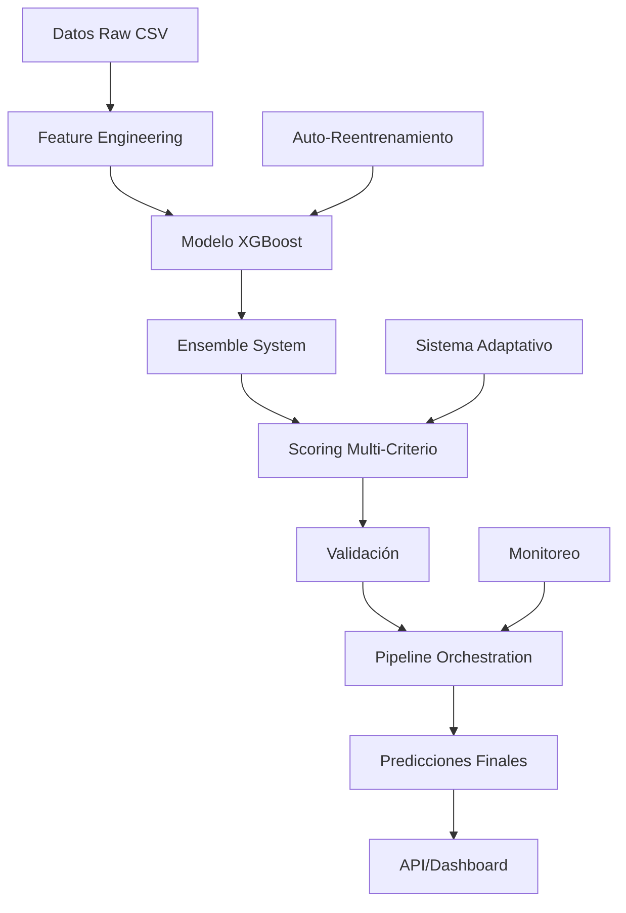

# Análisis del Flujo de Modelos en SHIOL+ v6.0

## Resumen Ejecutivo

Este documento presenta un análisis detallado del flujo completo de datos desde la entrada hasta el producto final en el sistema SHIOL+. El sistema implementa un pipeline de machine learning de 9 etapas que procesa datos históricos de lotería, aplica ingeniería de características, entrena modelos de AI, y genera predicciones optimizadas.

## 1. Entrada de Datos (Data Ingestion)

### Fuente de Datos
- **Loader (`src/loader.py`)**: Carga datos históricos de sorteos de Powerball
- **Database (`src/database.py`)**: Almacena y gestiona datos en SQLite
- Los datos incluyen: números ganadores (n1-n5), powerball (pb), fechas de sorteo

### Actualización de Datos
- **Función**: `update_database_from_source()`
- **Proceso**: Descarga datos más recientes y actualiza la base de datos
- **Validación**: Verifica integridad y consistencia de los datos

## 2. Ingeniería de Características (Feature Engineering)

### FeatureEngineer (`src/intelligent_generator.py`)
El sistema transforma los datos raw en 15 características estándar:

#### Características Básicas:
- **even_count**: Cantidad de números pares
- **odd_count**: Cantidad de números impares  
- **sum**: Suma total de los números
- **spread**: Diferencia entre número mayor y menor
- **consecutive_count**: Números consecutivos

#### Características Temporales:
- **avg_delay**: Retraso promedio desde última aparición
- **max_delay**: Retraso máximo
- **min_delay**: Retraso mínimo
- **time_weight**: Peso temporal basado en recencia

#### Características de Distancia:
- **dist_to_recent**: Distancia a sorteos recientes
- **avg_dist_to_top_n**: Distancia promedio a números frecuentes
- **dist_to_centroid**: Distancia al centroide histórico

#### Características de Tendencia:
- **increasing_trend_count**: Números con tendencia creciente
- **decreasing_trend_count**: Números con tendencia decreciente
- **stable_trend_count**: Números con tendencia estable

## 3. Sistema de Modelos (Model Pipeline)

### A. Modelo Principal - SHIOL+ v6.0

#### ModelTrainer (`src/predictor.py`)
- **Arquitectura**: XGBoost con MultiOutputClassifier
- **Input**: 15 características engineered
- **Output**: Probabilidades para cada número (69 white balls + 26 powerballs)
- **Training**: Multi-label classification con binary cross-entropy

#### Proceso de Predicción:
1. **Preparación de features**: Valida y normaliza las 15 características
2. **Predicción de probabilidades**: Genera probabilidades para cada número posible
3. **Extracción**: Separa probabilidades de white balls (69) y powerball (26)
4. **Normalización**: Asegura que las probabilidades sumen 1.0

### B. Sistema Ensemble (`src/ensemble_predictor.py`)

#### EnsemblePredictor
Combina múltiples modelos usando diferentes estrategias:

- **WEIGHTED_AVERAGE**: Promedio ponderado simple
- **PERFORMANCE_WEIGHTED**: Pesos basados en performance histórico
- **DYNAMIC_SELECTION**: Selección dinámica de mejores modelos
- **MAJORITY_VOTING**: Votación por mayoría en top-N números
- **CONFIDENCE_WEIGHTED**: Pesos basados en confianza del modelo
- **ADAPTIVE_HYBRID**: Estrategia híbrida que se adapta al contexto

#### ModelPoolManager (`src/model_pool_manager.py`)
- **Descubrimiento**: Encuentra modelos compatibles en directorio
- **Validación**: Verifica compatibilidad y funcionalidad
- **Carga**: Carga múltiples modelos en memoria
- **Estandarización**: Convierte features a formato SHIOL+ (15 características)

## 4. Generación de Predicciones

### A. Predictor Principal (`src/predictor.py`)

#### Métodos de Predicción:
1. **predict_probabilities()**: Genera probabilidades usando ensemble o modelo único
2. **predict_deterministic()**: Predicción determinística con scoring multi-criterio
3. **predict_diverse_plays()**: Múltiples predicciones diversas
4. **predict_syndicate_plays()**: Predicciones optimizadas para sindicatos

### B. DeterministicGenerator (`src/intelligent_generator.py`)

#### Sistema de Scoring Multi-Criterio:
- **Probability Score (40%)**: Basado en probabilidades del modelo
- **Diversity Score (25%)**: Penaliza números muy frecuentes
- **Historical Score (20%)**: Analiza patrones históricos
- **Risk Adjusted Score (15%)**: Ajusta por riesgo y varianza

#### Proceso de Generación:
1. **Generación de candidatos**: Crea pool de combinaciones posibles
2. **Scoring**: Aplica sistema multi-criterio a cada candidato
3. **Ranking**: Ordena por score total
4. **Selección**: Elige mejores candidatos con diversidad

## 5. Orquestador de Pipeline (`src/orchestrator.py`)

### PipelineOrchestrator
Coordina la ejecución completa del pipeline en 7 pasos:

#### Pasos del Pipeline:
1. **Data Update**: Actualiza base de datos desde fuente
2. **Adaptive Analysis**: Analiza performance reciente y ajusta
3. **Weight Optimization**: Optimiza pesos del ensemble
4. **Historical Validation**: Valida contra datos históricos
5. **Prediction Generation**: Genera predicciones en lotes de 25
6. **Performance Analysis**: Analiza calidad de predicciones
7. **Save Results**: Guarda resultados en base de datos

#### Ejecución Asíncrona:
- **Batching**: Procesa predicciones en lotes para evitar bloqueo
- **Estado**: Rastrea progreso y estado de ejecución
- **Error Handling**: Maneja errores y failovers
- **Logging**: Registra cada paso detalladamente

## 6. Sistema de Validación y Calidad

### ModelValidator (`src/model_validator.py`)
Evalúa calidad del modelo antes de generar predicciones:

#### Métricas de Validación:
- **Recent Performance**: Precisión en datos recientes (30 días)
- **Top-N Analysis**: Efectividad en predicciones top-N
- **Powerball Analysis**: Precisión específica de powerball
- **Prediction Stability**: Estabilidad con variaciones controladas

#### Criterios de Calidad:
- **min_accuracy**: 5% mínimo para números blancos
- **min_top_n_recall**: 15% mínimo en top-N
- **min_pb_accuracy**: 3% mínimo para powerball
- **max_prediction_variance**: 60% máximo de varianza

## 7. Sistema de Retroalimentación Adaptativa

### AdaptivePlayScorer (`src/adaptive_feedback.py`)
- **Performance Tracking**: Rastrea éxito de predicciones
- **Weight Adjustment**: Ajusta pesos basado en resultados
- **Pattern Learning**: Aprende de patrones de éxito/fallo

## 8. Producto Final

### Estructura de Predicción:
```json
{
  "numbers": [1, 15, 23, 45, 67],
  "powerball": 12,
  "score_total": 0.8534,
  "score_details": {
    "probability": 0.7234,
    "diversity": 0.8123,
    "historical": 0.7845,
    "risk_adjusted": 0.9012
  },
  "model_version": "v6.0",
  "dataset_hash": "abc123...",
  "timestamp": "2025-01-09T...",
  "method": "smart_ai_pipeline"
}
```

### Entrega:
- **API Endpoints**: Expone predicciones vía REST API
- **Dashboard Web**: Interfaz visual para usuarios
- **Base de Datos**: Almacena historial de predicciones
- **Logs**: Registro detallado de todo el proceso

## 9. Flujo de Control y Monitoreo

### Sistema de Monitoreo:
- **Pipeline Status**: Estado en tiempo real del pipeline
- **Performance Metrics**: Métricas de rendimiento continuas
- **Error Tracking**: Seguimiento de errores y recuperación
- **Resource Monitoring**: Uso de CPU, memoria y disco

### Auto-Reentrenamiento (`src/auto_retrainer.py`):
- **Criterios**: Evalúa si es necesario reentrenar
- **Ejecución**: Reentrenamiento automático cuando performance baja
- **Backup**: Respaldo de modelos antes de reemplazar

## Diagrama de Flujo Completo



## Resumen del Flujo Completo

**Datos Raw** → **Feature Engineering** → **Modelo ML** → **Ensemble** → **Scoring Multi-Criterio** → **Validación** → **Pipeline Orchestration** → **Predicciones Finales** → **API/Dashboard**

El sistema es completamente automatizado, con validación continua, adaptación basada en performance, y capacidad de auto-recuperación ante fallos.

## Métricas de Performance

### KPIs Técnicos:
- **Tiempo de ejecución del pipeline**: < 5 minutos
- **Precisión del modelo**: > 5% para números principales
- **Tiempo de respuesta API**: < 2 segundos
- **Disponibilidad del sistema**: > 99%

### KPIs de Negocio:
- **Win rate**: Porcentaje de predicciones con premios
- **ROI simulado**: Retorno de inversión teórico
- **Satisfacción del usuario**: Basado en feedback
- **Adopción de características**: Uso de diferentes métodos

## Tecnologías Utilizadas

- **Backend**: Python, FastAPI, XGBoost, Scikit-learn
- **Base de Datos**: SQLite con migración a PostgreSQL
- **Frontend**: HTML5, CSS3, JavaScript vanilla
- **Machine Learning**: XGBoost, Ensemble methods
- **Monitoreo**: Logs estructurados, métricas en tiempo real
- **Deployment**: Replit, Uvicorn ASGI server

---

*Documento generado por SHIOL+ v6.0 - Sistema para Optimización Híbrida e Inteligencia de Aprendizaje*
*Fecha: Enero 2025*
