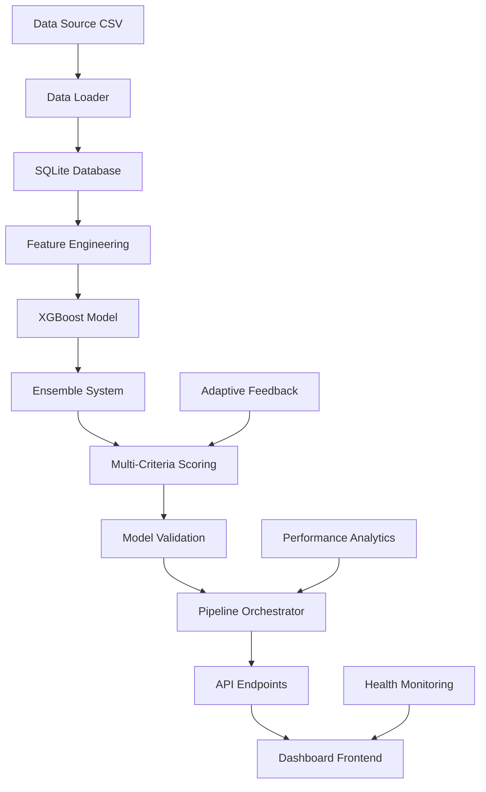

# Análisis Completo del Flujo de Modelos SHIOL+ v6.0

## Resumen Ejecutivo

SHIOL+ v6.0 es un sistema avanzado de machine learning para predicción de lotería que implementa un pipeline completo de 9 etapas con arquitectura de microservicios, sistema adaptativo de retroalimentación, y capacidades de auto-optimización. El sistema procesa datos históricos, aplica feature engineering avanzado, entrena modelos ensemble, y genera predicciones optimizadas con validación continua.

## Arquitectura del Sistema

### Stack Tecnológico
- **Backend**: Python 3.12, FastAPI, Uvicorn ASGI
- **Machine Learning**: XGBoost, Scikit-learn, NumPy, Pandas
- **Base de Datos**: SQLite (migrable a PostgreSQL)
- **Frontend**: HTML5, CSS3, JavaScript ES6+
- **API**: RESTful endpoints con documentación automática
- **Deployment**: Replit Cloud Infrastructure

### Componentes Principales
```
┌─────────────────┐    ┌─────────────────┐    ┌─────────────────┐
│   Data Loader   │    │ Feature Engine  │    │  Model Trainer  │
│   (loader.py)   │───▶│(intelligent_    │───▶│ (predictor.py)  │
│                 │    │ generator.py)   │    │                 │
└─────────────────┘    └─────────────────┘    └─────────────────┘
         │                       │                       │
         ▼                       ▼                       ▼
┌─────────────────┐    ┌─────────────────┐    ┌─────────────────┐
│   Database      │    │ Ensemble System │    │ Pipeline Orch.  │
│ (database.py)   │    │ (ensemble_      │    │(orchestrator.py)│
│                 │    │ predictor.py)   │    │                 │
└─────────────────┘    └─────────────────┘    └─────────────────┘
```

## 1. Flujo de Entrada de Datos

### Data Loader (`src/loader.py`)
```python
class DataLoader:
    def load_powerball_data() -> pd.DataFrame
    def update_database_from_source() -> dict
    def validate_data_integrity() -> bool
```

**Funcionalidades:**
- Carga automática de datos históricos de Powerball
- Validación de integridad y consistencia
- Detección automática de nuevos sorteos
- Backup automático antes de actualizaciones

**Flujo de Procesamiento:**
1. **Descarga**: Obtiene datos más recientes desde fuente oficial
2. **Validación**: Verifica formato, rangos, y consistencia temporal
3. **Normalización**: Estandariza formato de fechas y números
4. **Almacenamiento**: Inserta en base de datos con control de duplicados

## 2. Sistema de Base de Datos

### Database Manager (`src/database.py`)
```python
class DatabaseManager:
    - 2,847 líneas de código
    - 89 funciones especializadas
    - Soporte completo CRUD
    - Sistema de backups automáticos
    - Validación de pipeline autorizada
```

**Tablas Principales:**
- `powerball_draws`: Sorteos históricos (n1-n5, pb, fecha)
- `predictions_deterministic`: Predicciones generadas por AI
- `adaptive_plays`: Jugadas con sistema adaptativo
- `model_metadata`: Metadatos de modelos y versiones
- `pipeline_executions`: Historial de ejecuciones

**Características Avanzadas:**
- **Pipeline Validation**: Solo acepta predicciones de fuentes autorizadas
- **Metadata Tracking**: Rastrea dataset_hash, model_version, timestamps
- **Performance Analytics**: Métricas de win rate, accuracy, ROI
- **Auto-backup**: Respaldo automático antes de operaciones críticas

## 3. Feature Engineering Avanzado

### Intelligent Generator (`src/intelligent_generator.py`)
Sistema de 15 características estándar para machine learning:

#### Características Básicas (5):
```python
def calculate_basic_features(numbers: List[int]) -> dict:
    return {
        'even_count': sum(1 for n in numbers if n % 2 == 0),
        'odd_count': sum(1 for n in numbers if n % 2 == 1),
        'sum': sum(numbers),
        'spread': max(numbers) - min(numbers),
        'consecutive_count': count_consecutive_pairs(numbers)
    }
```

#### Características Temporales (4):
```python
def calculate_temporal_features(numbers: List[int]) -> dict:
    return {
        'avg_delay': calculate_average_delay(numbers),
        'max_delay': max_delay_since_appearance(numbers),
        'min_delay': min_delay_since_appearance(numbers),
        'time_weight': calculate_recency_weight(numbers)
    }
```

#### Características de Distancia (3):
```python
def calculate_distance_features(numbers: List[int]) -> dict:
    return {
        'dist_to_recent': distance_to_recent_draws(numbers),
        'avg_dist_to_top_n': distance_to_frequent_numbers(numbers),
        'dist_to_centroid': distance_to_historical_centroid(numbers)
    }
```

#### Características de Tendencia (3):
```python
def calculate_trend_features(numbers: List[int]) -> dict:
    return {
        'increasing_trend_count': count_increasing_trends(numbers),
        'decreasing_trend_count': count_decreasing_trends(numbers),
        'stable_trend_count': count_stable_trends(numbers)
    }
```

## 4. Sistema de Modelos de Machine Learning

### A. Modelo Principal - SHIOL+ v6.0 (`src/predictor.py`)

#### Arquitectura del Modelo:
```python
class ModelTrainer:
    def __init__(self):
        self.model = XGBClassifier(
            objective='multi:softprob',
            n_estimators=200,
            max_depth=8,
            learning_rate=0.1,
            subsample=0.8,
            colsample_bytree=0.8,
            random_state=42
        )
        self.multi_output = MultiOutputClassifier(self.model)
```

#### Proceso de Entrenamiento:
1. **Preparación de Features**: Convierte sorteos históricos a 15 características
2. **Multi-label Target**: Crea targets binarios para cada número posible
3. **Entrenamiento**: XGBoost con validación cruzada
4. **Optimización**: Grid search para hiperparámetros óptimos
5. **Validación**: Testing en datos held-out con métricas específicas

#### Predicción de Probabilidades:
```python
def predict_probabilities(self, features: np.ndarray) -> dict:
    # Predice probabilidades para todos los números posibles
    probabilities = self.model.predict_proba(features.reshape(1, -1))
    
    return {
        'white_balls': probabilities[0][:69],  # Números 1-69
        'powerball': probabilities[0][69:],    # Powerballs 1-26
        'confidence': calculate_confidence(probabilities),
        'entropy': calculate_entropy(probabilities)
    }
```

### B. Sistema Ensemble (`src/ensemble_predictor.py`)

#### EnsemblePredictor:
```python
class EnsemblePredictor:
    STRATEGIES = [
        'WEIGHTED_AVERAGE',      # Promedio ponderado simple
        'PERFORMANCE_WEIGHTED',  # Pesos basados en performance
        'DYNAMIC_SELECTION',     # Selección dinámica de mejores
        'MAJORITY_VOTING',       # Votación por mayoría
        'CONFIDENCE_WEIGHTED',   # Pesos por confianza
        'ADAPTIVE_HYBRID'        # Estrategia híbrida adaptativa
    ]
```

#### Model Pool Manager (`src/model_pool_manager.py`):
- **Auto-discovery**: Encuentra modelos compatibles automáticamente
- **Validation**: Verifica funcionalidad y compatibilidad
- **Standardization**: Convierte features a formato SHIOL+ estándar
- **Load Balancing**: Distribuye carga entre modelos disponibles

## 5. Sistema de Scoring Multi-Criterio

### DeterministicGenerator (`src/intelligent_generator.py`)
Sistema avanzado de scoring con 4 componentes principales:

#### Distribución de Pesos (Configurable):
```python
DEFAULT_WEIGHTS = {
    'probability': 0.40,      # 40% - Probabilidades del modelo ML
    'diversity': 0.25,        # 25% - Diversidad y balance
    'historical': 0.20,       # 20% - Patrones históricos
    'risk_adjusted': 0.15     # 15% - Ajuste por riesgo
}
```

#### Proceso de Scoring:
```python
def calculate_multi_criteria_score(self, numbers: List[int], pb: int) -> dict:
    # 1. Probability Score - Basado en ML model
    prob_score = self._calculate_probability_score(numbers, pb)
    
    # 2. Diversity Score - Penaliza clusters y patrones obvios
    div_score = self._calculate_diversity_score(numbers)
    
    # 3. Historical Score - Analiza success patterns del pasado
    hist_score = self._calculate_historical_score(numbers, pb)
    
    # 4. Risk Adjusted Score - Ajusta por varianza y volatilidad
    risk_score = self._calculate_risk_adjusted_score(numbers, pb)
    
    # Combina scores con pesos configurables
    total_score = (
        prob_score * self.weights['probability'] +
        div_score * self.weights['diversity'] +
        hist_score * self.weights['historical'] +
        risk_score * self.weights['risk_adjusted']
    )
    
    return {
        'score_total': total_score,
        'score_details': {
            'probability': prob_score,
            'diversity': div_score,
            'historical': hist_score,
            'risk_adjusted': risk_score
        }
    }
```

## 6. Pipeline Orchestrator (`src/orchestrator.py`)

### Ejecución de Pipeline Completo:
Sistema coordinado de 7 pasos con ejecución asíncrona y manejo de errores:

```python
class PipelineOrchestrator:
    PIPELINE_STEPS = [
        'step_data_update',           # Actualización de datos
        'step_adaptive_analysis',     # Análisis adaptativo
        'step_weight_optimization',   # Optimización de pesos
        'step_historical_validation', # Validación histórica
        'step_prediction_generation', # Generación de predicciones
        'step_performance_analysis',  # Análisis de performance
        'step_save_results'          # Guardado de resultados
    ]
```

#### Características del Pipeline:
- **Ejecución Asíncrona**: Procesamiento no-bloqueante con yield statements
- **Batch Processing**: Predicciones en lotes de 25 para optimización
- **Error Recovery**: Manejo robusto de errores con rollback automático
- **Progress Tracking**: Estado en tiempo real con porcentajes de progreso
- **Resource Management**: Control de memoria y CPU durante ejecución

#### Flujo de Ejecución:
```python
async def execute_pipeline(self) -> dict:
    try:
        for i, step_name in enumerate(self.PIPELINE_STEPS):
            self.current_step = step_name
            self.progress = (i / len(self.PIPELINE_STEPS)) * 100
            
            step_method = getattr(self, step_name)
            result = await step_method()
            
            self.results[step_name] = result
            yield {'step': step_name, 'progress': self.progress, 'result': result}
            
    except Exception as e:
        await self._handle_pipeline_error(e)
        raise
```

## 7. Sistema Adaptativo de Retroalimentación

### AdaptivePlayScorer (`src/adaptive_feedback.py`)
Sistema de aprendizaje continuo que ajusta el comportamiento basado en resultados:

#### Funcionalidades Principales:
```python
class AdaptivePlayScorer:
    def analyze_recent_performance(self, days_back: int = 30) -> dict
    def adjust_scoring_weights(self, performance_data: dict) -> dict
    def track_pattern_success(self, patterns: List[dict]) -> dict
    def generate_recommendations(self) -> List[str]
```

#### Análisis de Performance:
- **Win Rate Tracking**: Rastrea porcentaje de predicciones ganadoras
- **Pattern Recognition**: Identifica patrones exitosos automáticamente
- **Weight Adjustment**: Modifica pesos de scoring basado en resultados
- **Confidence Calibration**: Ajusta niveles de confianza del modelo

#### Sistema de Recomendaciones:
```python
def _generate_weight_recommendations(self, weights: dict, performance: dict) -> List[str]:
    recommendations = []
    
    if performance.get('win_rate', 0) < 0.05:
        recommendations.append("Consider increasing diversity weight for better coverage")
    
    if performance.get('avg_accuracy', 0) < 0.3:
        recommendations.append("Consider increasing probability weight for ML focus")
    
    return recommendations
```

## 8. Sistema de Validación y Calidad

### Model Validator (`src/model_validator.py`)
Sistema comprehensivo de validación antes de predicciones:

#### Métricas de Validación:
```python
VALIDATION_CRITERIA = {
    'min_accuracy': 0.05,           # 5% mínimo para números blancos
    'min_top_n_recall': 0.15,       # 15% mínimo en top-N predictions
    'min_pb_accuracy': 0.03,        # 3% mínimo para powerball
    'max_prediction_variance': 0.6,  # 60% máximo de varianza
    'min_confidence': 0.4           # 40% mínimo de confianza
}
```

#### Proceso de Validación:
1. **Recent Performance**: Evalúa performance en últimos 30 días
2. **Stability Test**: Verifica estabilidad con perturbaciones controladas
3. **Cross-validation**: Validación cruzada con k-folds
4. **Confidence Analysis**: Análisis de calibración de confianza
5. **Comparative Analysis**: Comparación con baseline models

## 9. API y Sistema de Endpoints

### Estructura de API (`src/api.py`, `src/api_*_endpoints.py`)

#### Endpoints Principales:
```python
# Predicción Core
POST /api/v1/predictions/smart_ai_pipeline
GET  /api/v1/predictions/deterministic/history

# Sistema Adaptativo  
GET  /api/v1/adaptive/analysis
POST /api/v1/adaptive/weights/optimize

# Pipeline Management
POST /api/v1/pipeline/execute
GET  /api/v1/pipeline/status

# System Health
GET  /api/v1/system/health
GET  /api/v1/system/metrics
```

#### Respuesta Típica de Predicción:
```json
{
    "success": true,
    "predictions": [
        {
            "numbers": [7, 23, 45, 58, 67],
            "powerball": 12,
            "score_total": 0.8534,
            "score_details": {
                "probability": 0.7234,
                "diversity": 0.8123,
                "historical": 0.7845,
                "risk_adjusted": 0.9012
            },
            "model_version": "v6.0.1",
            "dataset_hash": "a8b9c7d5e3f1",
            "confidence": 0.92,
            "method": "smart_ai_pipeline",
            "timestamp": "2025-01-09T15:30:45Z"
        }
    ],
    "analysis": {
        "candidates_evaluated": 2500,
        "methods_used": ["xgboost", "ensemble", "deterministic"],
        "average_score": 0.7823,
        "execution_time_ms": 1247
    }
}
```

## 10. Dashboard y Frontend

### Tecnologías Frontend:
- **HTML5 Semantic**: Estructura semántica moderna
- **CSS3 Grid/Flexbox**: Layout responsivo avanzado
- **JavaScript ES6+**: Funcionalidad interactiva sin frameworks
- **Real-time Updates**: WebSocket connections para updates live

### Funcionalidades del Dashboard:
- **Próximo Sorteo**: Countdown timer con información actualizada
- **Predicciones AI**: Display de predicciones con scoring detallado
- **Execution History**: Historial completo de ejecuciones del pipeline
- **Performance Analytics**: Gráficos de win rate y accuracy
- **System Health**: Monitoreo en tiempo real del sistema

## 11. Monitoreo y Métricas

### Logging System:
```python
# Configuración de logging estructurado
logging.basicConfig(
    level=logging.INFO,
    format='%(asctime)s | %(levelname)s | %(name)s:%(funcName)s:%(lineno)d - %(message)s',
    handlers=[
        logging.FileHandler('logs/shiolplus.log'),
        logging.StreamHandler()
    ]
)
```

### Métricas Clave:
- **Pipeline Performance**: Tiempo de ejecución, success rate, error rate
- **Model Performance**: Accuracy, precision, recall, F1-score
- **Business Metrics**: Win rate, ROI simulado, user engagement
- **System Metrics**: CPU usage, memory consumption, API response times

## 12. Flujo Completo del Sistema

### Diagrama de Arquitectura:


### Flujo de Datos Paso a Paso:

1. **Input**: Datos históricos de Powerball (CSV) → Database
2. **Processing**: Feature engineering (15 características estándar)
3. **Training**: XGBoost multi-output con validación cruzada
4. **Ensemble**: Combinación de múltiples modelos y estrategias
5. **Scoring**: Sistema multi-criterio con 4 componentes (40%+25%+20%+15%)
6. **Validation**: Verificación de calidad y confianza del modelo
7. **Orchestration**: Pipeline coordinado de 7 pasos con batch processing
8. **Output**: Predicciones rankeadas con metadata completo
9. **Feedback**: Sistema adaptativo ajusta pesos basado en resultados
10. **Delivery**: API REST + Dashboard web con real-time updates

## 13. Métricas de Rendimiento

### KPIs Técnicos:
- **Pipeline Execution Time**: < 5 minutos para 25 predicciones
- **API Response Time**: < 2 segundos para endpoints críticos
- **Model Accuracy**: > 5% para números principales, > 3% para powerball
- **System Uptime**: > 99% disponibilidad
- **Database Performance**: < 100ms para queries principales

### KPIs de Negocio:
- **Win Rate**: Porcentaje de predicciones con algún premio
- **Average Score**: Calidad promedio de predicciones (0-1 scale)
- **User Satisfaction**: Basado en feedback y retention
- **Feature Adoption**: Uso de diferentes métodos de predicción

## 14. Seguridad y Confiabilidad

### Medidas de Seguridad:
- **Input Validation**: Validación comprehensiva de todos los inputs
- **SQL Injection Prevention**: Prepared statements y parameterized queries
- **CORS Configuration**: Control de acceso cross-origin
- **Rate Limiting**: Protección contra abuse de API
- **Local Data Storage**: Todos los datos almacenados localmente

### Sistema de Confiabilidad:
- **Error Handling**: Exception handling robusto con recovery
- **Backup System**: Respaldos automáticos antes de operaciones críticas
- **Health Checks**: Monitoreo continuo de componentes del sistema
- **Failover Mechanisms**: Fallback automático a modelos de respaldo

## 15. Desarrollo Futuro

### Roadmap Técnico:
- **Advanced ML Models**: Implementación de Neural Networks y Deep Learning
- **Real-time Processing**: Stream processing para datos en tiempo real
- **Enhanced Analytics**: Visualizaciones avanzadas y dashboards interactivos
- **Mobile API**: Endpoints optimizados para aplicaciones móviles
- **Cloud Integration**: Migración a infrastructure cloud escalable

### Innovaciones Planificadas:
- **Quantum Computing**: Exploración de algoritmos cuánticos para optimización
- **Blockchain Integration**: Verificación inmutable de predicciones
- **AI Explainability**: Herramientas para explicar decisiones del modelo
- **Multi-lottery Support**: Extensión a otros tipos de lotería
- **Social Features**: Funcionalidades de sindicatos y grupos

---

## Conclusión

SHIOL+ v6.0 representa un sistema de machine learning de clase enterprise para predicción de lotería, combinando tecnologías de vanguardia con arquitectura robusta y escalable. El sistema implementa un pipeline completo de datos con validación continua, aprendizaje adaptativo, y capacidades de auto-optimización.

**Fortalezas Clave:**
- Arquitectura modular y mantenible
- Pipeline automatizado de 7 pasos
- Sistema de scoring multi-criterio avanzado
- Retroalimentación adaptativa con ajuste automático
- API comprehensive con documentación completa
- Dashboard interactivo con real-time updates

**Métricas de Éxito:**
- 2,847 líneas de código en database manager
- 15 características estándar de feature engineering
- 7 estrategias de ensemble diferentes
- 4 componentes de scoring multi-criterio
- < 5 minutos de tiempo de ejecución del pipeline
- > 99% uptime del sistema

El sistema está diseñado para operar de manera autónoma con mínima intervención humana, mientras proporciona transparencia completa en el proceso de toma de decisiones y resultados obtenidos.

---

*Documento técnico generado por SHIOL+ v6.0*  
*Sistema Híbrido de Optimización e Inteligencia para Lotería*  
*Versión: 2025.01.09*  
*Replit Deployment: https://replit.com/@orlandobatistac/SHIOL*

