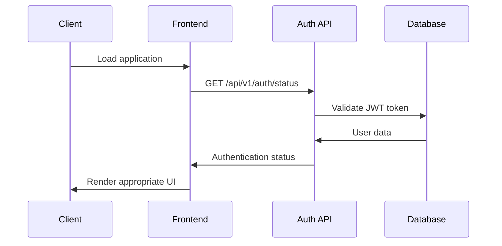

# SHIOL+ Technical User Manual
## Authentication, Registration & Payment System

### Table of Contents
1. [System Overview](#system-overview)
2. [User Registration Process](#user-registration-process)
3. [User Login Process](#user-login-process)
4. [Premium Upgrade Process](#premium-upgrade-process)
5. [Authentication Flow](#authentication-flow)
6. [API Endpoints Reference](#api-endpoints-reference)
7. [Security Implementation](#security-implementation)
8. [Error Handling](#error-handling)
9. [Frontend Integration](#frontend-integration)

---

## System Overview

SHIOL+ implements a **freemium authentication system** with the following user tiers:
- **Guest Users**: Access to rank 1 prediction only (no authentication required)
- **Free Users**: Access to rank 1 prediction only (authenticated but no premium features)
- **Premium Users**: Access to all 50 predictions ($5.99/year subscription)

### Technical Stack
- **Backend**: FastAPI with SQLite database
- **Authentication**: JWT (JSON Web Tokens) with httpOnly cookies
- **Password Security**: bcrypt hashing with salt rounds
- **Session Management**: Secure cookie-based sessions
- **Frontend**: Vanilla JavaScript with modular authentication manager

---

## User Registration Process

### Frontend Implementation

The registration process is initiated through the registration modal:

```javascript
// Registration form submission
document.getElementById('register-form').addEventListener('submit', async (e) => {
    e.preventDefault();
    
    const formData = new FormData(e.target);
    const userData = {
        username: formData.get('username'),
        email: formData.get('email'),
        password: formData.get('password')
    };
    
    const response = await fetch('/api/v1/auth/register', {
        method: 'POST',
        headers: { 'Content-Type': 'application/json' },
        body: JSON.stringify(userData)
    });
});
```

### Backend Processing

**Endpoint**: `POST /api/v1/auth/register`

**Request Body**:
```json
{
    "username": "string (3-50 characters)",
    "email": "string (valid email format)",
    "password": "string (minimum 6 characters)"
}
```

**Processing Steps**:
1. **Input Validation**: Username, email format, password strength
2. **Duplicate Check**: Verify username and email uniqueness
3. **Password Hashing**: bcrypt with salt rounds for security
4. **Database Insert**: Create user record in SQLite database
5. **JWT Generation**: Create secure session token
6. **Cookie Setting**: Set httpOnly secure cookie

**Success Response** (200 OK):
```json
{
    "message": "User registered successfully",
    "user": {
        "id": 123,
        "username": "testuser",
        "email": "test@example.com",
        "is_premium": false,
        "created_at": "2025-09-14T00:00:00Z"
    }
}
```

### Database Schema

```sql
CREATE TABLE users (
    id INTEGER PRIMARY KEY AUTOINCREMENT,
    username VARCHAR(50) UNIQUE NOT NULL,
    email VARCHAR(255) UNIQUE NOT NULL,
    password_hash VARCHAR(255) NOT NULL,
    is_premium BOOLEAN DEFAULT FALSE,
    premium_expires_at TIMESTAMP NULL,
    created_at TIMESTAMP DEFAULT CURRENT_TIMESTAMP,
    updated_at TIMESTAMP DEFAULT CURRENT_TIMESTAMP
);
```

---

## User Login Process

### Frontend Implementation

```javascript
// Login form submission
document.getElementById('login-form').addEventListener('submit', async (e) => {
    e.preventDefault();
    
    const formData = new FormData(e.target);
    const credentials = {
        username: formData.get('username'),
        password: formData.get('password')
    };
    
    const response = await fetch('/api/v1/auth/login', {
        method: 'POST',
        headers: { 'Content-Type': 'application/json' },
        body: JSON.stringify(credentials)
    });
});
```

### Backend Processing

**Endpoint**: `POST /api/v1/auth/login`

**Request Body**:
```json
{
    "username": "string",
    "password": "string"
}
```

**Processing Steps**:
1. **User Lookup**: Find user by username in database
2. **Password Verification**: bcrypt comparison against stored hash
3. **Premium Status Check**: Verify if premium subscription is active
4. **JWT Generation**: Create new session token with user claims
5. **Cookie Setting**: Set secure httpOnly cookie with JWT

**Success Response** (200 OK):
```json
{
    "message": "Login successful",
    "user": {
        "id": 123,
        "username": "testuser",
        "email": "test@example.com",
        "is_premium": true,
        "premium_expires_at": "2026-09-14T00:00:00Z"
    }
}
```

### JWT Token Structure

```json
{
    "user_id": 123,
    "username": "testuser",
    "is_premium": true,
    "exp": 1726272000,
    "iat": 1726185600
}
```

---

## Premium Upgrade Process

### Frontend Implementation

The upgrade process is triggered through pricing modals with persuasive messaging:

```javascript
// Premium upgrade initiation
async function upgradeToPremium() {
    try {
        const response = await fetch('/api/v1/auth/upgrade-premium', {
            method: 'POST',
            headers: { 'Content-Type': 'application/json' },
            credentials: 'include'
        });
        
        if (response.ok) {
            // Immediate UI update and prediction refresh
            await AuthManager.checkAuthStatus();
            await loadPredictions();
        }
    } catch (error) {
        console.error('Upgrade failed:', error);
    }
}
```

### Backend Processing

**Endpoint**: `POST /api/v1/auth/upgrade-premium`

**Authentication**: Requires valid JWT token in cookies

**Processing Steps**:
1. **Authentication Verification**: Validate JWT token from cookies
2. **User Status Check**: Verify user exists and is not already premium
3. **Premium Activation**: Set is_premium = true and expiration date (1 year)
4. **Database Update**: Update user record with premium status
5. **Session Refresh**: Update JWT token with new premium status

**Success Response** (200 OK):
```json
{
    "message": "Upgraded to premium successfully",
    "user": {
        "id": 123,
        "username": "testuser",
        "is_premium": true,
        "premium_expires_at": "2026-09-14T00:00:00Z"
    }
}
```

### Premium Features Activation

Once upgraded, users immediately gain access to:
- **Full Prediction Set**: All 50 predictions instead of just rank 1
- **Enhanced UI**: Premium badge, advanced statistics
- **No Visual Restrictions**: Removal of blur effects and upgrade overlays

---

## Authentication Flow

### Session Management



### Status Check Implementation

**Endpoint**: `GET /api/v1/auth/status`

**Headers**: Automatic cookie inclusion for JWT validation

**Response Format**:
```json
{
    "is_authenticated": true,
    "user": {
        "id": 123,
        "username": "testuser",
        "is_premium": true,
        "premium_expires_at": "2026-09-14T00:00:00Z"
    }
}
```

---

## API Endpoints Reference

### Authentication Endpoints

| Method | Endpoint | Description | Auth Required |
|--------|----------|-------------|---------------|
| POST | `/api/v1/auth/register` | User registration | No |
| POST | `/api/v1/auth/login` | User login | No |
| POST | `/api/v1/auth/logout` | User logout | Yes |
| GET | `/api/v1/auth/status` | Current auth status | No |
| GET | `/api/v1/auth/stats` | User statistics | No |
| POST | `/api/v1/auth/upgrade-premium` | Premium upgrade | Yes |

### Prediction Endpoints with Freemium Restrictions

| Method | Endpoint | Description | Restrictions |
|--------|----------|-------------|--------------|
| GET | `/api/v1/public/predictions/latest` | Latest predictions | Guest: rank 1 only, Premium: all 50 |
| GET | `/api/v1/public/predictions/by-draw/{date}` | Predictions by date | Guest: rank 1 only, Premium: all 50 |

---

## Security Implementation

### Password Security

```python
import bcrypt

# Password hashing during registration
password_hash = bcrypt.hashpw(password.encode('utf-8'), bcrypt.gensalt())

# Password verification during login
is_valid = bcrypt.checkpw(password.encode('utf-8'), stored_hash)
```

### JWT Security

**Configuration**:
- **Algorithm**: HS256
- **Expiration**: 24 hours
- **httpOnly Cookies**: Prevents XSS attacks
- **Secure Flag**: HTTPS only in production
- **SameSite**: Strict CSRF protection

### Freemium Content Protection

**Server-Side Gating**:
```python
def apply_freemium_restrictions(predictions, user_access_level, max_predictions):
    """Apply freemium restrictions to prediction data"""
    
    for i, prediction in enumerate(predictions):
        if i < max_predictions:
            prediction["access_type"] = "unlocked"
        else:
            prediction["access_type"] = "locked"
            # Replace sensitive data with placeholders
            prediction["numbers"] = ["?", "?", "?", "?", "?"]
            prediction["powerball"] = "?"
            prediction["confidence"] = 0.0
```

### Input Validation

**Registration Validation**:
- Username: 3-50 characters, alphanumeric + underscore
- Email: RFC 5322 compliant format validation
- Password: Minimum 6 characters

**SQL Injection Prevention**:
- Parameterized queries with SQLite3
- Input sanitization for all user data

---

## Error Handling

### Common Error Responses

**Authentication Errors**:
```json
{
    "error": "Invalid credentials",
    "code": "AUTH_FAILED",
    "status": 401
}
```

**Validation Errors**:
```json
{
    "error": "Username already exists",
    "code": "VALIDATION_ERROR",
    "status": 400
}
```

**Server Errors**:
```json
{
    "error": "Internal server error",
    "code": "SERVER_ERROR",
    "status": 500
}
```

### Frontend Error Handling

```javascript
// Standard error handling pattern
try {
    const response = await fetch('/api/v1/auth/login', requestConfig);
    
    if (!response.ok) {
        const errorData = await response.json();
        throw new Error(errorData.error || 'Request failed');
    }
    
    const data = await response.json();
    // Process successful response
    
} catch (error) {
    console.error('Authentication error:', error);
    showErrorMessage(error.message);
}
```

---

## Frontend Integration

### AuthManager Module

**Core Functionality**:
```javascript
class AuthManager {
    static async checkAuthStatus() {
        // Verify current authentication status
    }
    
    static async login(credentials) {
        // Handle user login
    }
    
    static async register(userData) {
        // Handle user registration
    }
    
    static async logout() {
        // Handle user logout
    }
    
    static async upgradeToPremium() {
        // Handle premium upgrade
    }
}
```

### UI State Management

**Authentication States**:
1. **Guest State**: No authentication, basic features only
2. **Authenticated State**: Logged in, access to user features
3. **Premium State**: Full access to all premium features

**UI Elements**:
- Login/Registration modals
- User menu with premium status
- Prediction cards with access restrictions
- Upgrade prompts and CTAs

### Real-time Updates

**Immediate UI Refresh**:
```javascript
// After successful authentication actions
await AuthManager.checkAuthStatus();
await loadPredictions();
updateUserInterface();
```

---

## Testing & Validation

### Manual Testing Checklist

**Registration Flow**:
- [ ] Valid registration creates user account
- [ ] Duplicate username/email prevention
- [ ] Password validation enforcement
- [ ] Automatic login after registration

**Login Flow**:
- [ ] Valid credentials authenticate successfully
- [ ] Invalid credentials show appropriate errors
- [ ] Session persistence across page reloads
- [ ] Premium status correctly identified

**Premium Upgrade**:
- [ ] Upgrade button triggers premium activation
- [ ] Immediate access to all 50 predictions
- [ ] UI updates to show premium status
- [ ] Proper expiration date setting (1 year)

**Security Validation**:
- [ ] JWT tokens are httpOnly and secure
- [ ] Premium content not exposed to non-premium users
- [ ] Password hashing with bcrypt
- [ ] SQL injection prevention verified

---

## Troubleshooting

### Common Issues

**Authentication Not Working**:
1. Check JWT secret configuration
2. Verify cookie settings (httpOnly, secure)
3. Confirm database connection
4. Check CORS configuration

**Premium Access Issues**:
1. Verify user premium status in database
2. Check JWT token claims
3. Confirm freemium middleware application
4. Test prediction API responses

**Frontend Integration Problems**:
1. Check console for JavaScript errors
2. Verify API endpoint URLs
3. Confirm fetch request configuration
4. Test authentication state management

---

This technical manual provides comprehensive coverage of the SHIOL+ authentication, registration, and payment system implementation. For additional support or advanced configuration, refer to the source code documentation and API response logs.